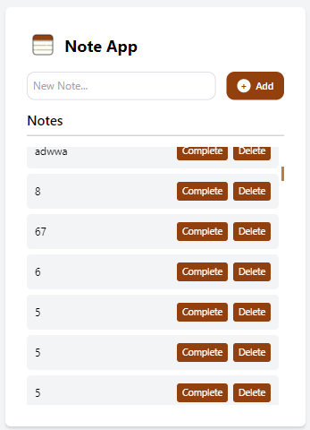

# Note App

A simple to-do list web application built using **React**, **MQTT**, **WebSockets**, and **Tailwind CSS**. The app allows users to add, mark as complete, and delete notes in a streamlined user interface.



## Features

- Add new notes.
- Mark notes as complete.
- Delete notes.
- Real-time updates via MQTT and WebSockets.
- Responsive design with Tailwind CSS.

## Tech Stack

- **Frontend**: React, Tailwind CSS
- **Backend**: Node.js, MQTT, WebSockets
- **Database**: [Mention if any specific database is used, if applicable]
- **Other**: MQTT protocol for real-time communication

## Installation

1. Clone the repository:
   ```bash
   git clone https://github.com/devanshchoudhary20/FULLSTACK_TASK_DEVANSH.git
